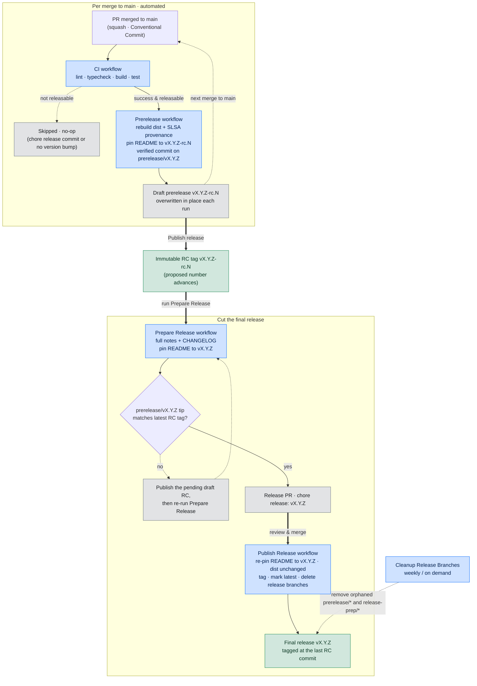

# Releasing & rollback runbook

Maintainer-facing notes for cutting, promoting, and rolling back releases. The pipeline is automated; this document covers the manual decision points and the break-glass procedures.

## Model at a glance

- **Release candidates (RCs)** are prepared automatically on every merge to `main`, but always as a **draft** `vX.Y.Z-rc.N` prerelease. The single draft is overwritten in place on each run (keeping the same proposed number) until a maintainer **manually promotes** it by publishing the draft. Its notes show only the incremental changes since the previously promoted RC.
- **The final release** is opened deliberately via the **Prepare Release** workflow, reviewed as a pull request, and published on merge. Its notes contain **all** changes since the previous final release. It is tagged at the last RC commit with the README usage examples re-pinned from the RC tag to the final `vX.Y.Z`; only the README changes, so `dist/` stays byte-identical to the RC.

## Lifecycle at a glance



- **Bold arrows** are the three manual maintainer gates - publish a draft to mint the `vX.Y.Z-rc.N` tag, run **Prepare Release**, and review & merge the release PR.
- **Dotted arrows** are skip / loop / return / cleanup paths; solid arrows are automated hand-offs. Green nodes are the immutable, published artifacts (RC tags and the final release); blue nodes are the workflows that produce them.

## How a release candidate is produced

1. **Merge to `main`.** PR titles must follow [Conventional Commits](https://www.conventionalcommits.org) (enforced by the `PR Title` workflow). With squash-merge the PR title becomes the commit subject that drives version bumping. **Use squash merges.**

   > Because version bumping and changelog generation read the squashed commit subject, configure the repository to **allow squash merging only** (Settings -> General -> Pull Requests: enable "Allow squash merging", disable merge commits and rebase merging, and default the squash commit message to the PR title). A stray merge or rebase merge can land non-conventional subjects that break `git cliff --bump` and the notes.
2. **CI** (`ci.yml`) runs lint, type-check, build, and the cross-OS test matrix.
3. **Prerelease** (`prerelease.yml`) runs on CI success for `main` (and is skipped for `chore(release)` commits):
   - rebuilds `dist/` from the exact tested commit and attaches a signed SLSA build provenance attestation,
   - skips entirely if no version-bumping commits landed (no-op guard),
   - pins the `README.md` usage examples to the RC tag `vX.Y.Z-rc.N`, so the draft/prerelease advertises the exact version a consumer would install from it (the final release re-pins these to the stable `vX.Y.Z` when cut),
   - creates a GitHub-**verified** commit on the `prerelease/vX.Y.Z` branch (curated release files only); this branch tip always points at the latest RC,
   - overwrites the pending **draft** prerelease `vX.Y.Z-rc.N` (deleting any previous draft RC first), so at most one draft is ever pending and it targets that branch tip.

**Promoting a draft to a real RC.** RCs are never published automatically. When a draft looks good, open it on the **Releases** page and click **Publish release**. That creates the immutable `vX.Y.Z-rc.N` tag at the current `prerelease/vX.Y.Z` branch tip and advances the proposed number for the next draft.

## Cutting the final release

1. Run the **Prepare Release** workflow (Actions tab -> Prepare Release -> Run workflow). It:
   - computes the target version and the **full** notes since the last final release,
   - verifies a `prerelease/vX.Y.Z` branch exists and its tip matches the latest published `vX.Y.Z-rc.N` tag (publish the current draft RC first if the branch has moved),
   - updates `CHANGELOG.md` and pins the `README.md` usage examples to `vX.Y.Z` (so the default branch docs match the published tag),
   - opens a PR titled `chore(release): vX.Y.Z` with the full notes as its body.
2. Review the PR (notes + `CHANGELOG.md`). Edit the PR body if you want to adjust the published notes. **Merge it** (squash).
3. `publish-release.yml` runs on the merge and:
   - re-pins the `README.md` usage examples on the last RC commit from the RC tag to `vX.Y.Z` (a verified commit that touches only `README.md`; `dist/` is carried over byte-identical),
   - tags `vX.Y.Z` at that commit and marks it `latest`,
   - deletes the `prerelease/vX.Y.Z` and `release-prep/vX.Y.Z` branches.

> The release PR is created by the workflow token, so token-triggered checks (such as `PR Title`) do not re-run on it. The title is correct by construction. If you make those checks required, exclude `release-prep/*` or create the PR with a PAT.

## Cleaning up orphaned release branches

`publish-release.yml` deletes `prerelease/vX.Y.Z` and `release-prep/vX.Y.Z` when a final release ships, so between releases there are normally no release branches. These cases are not covered by that on-publish cleanup:

- a `prerelease/vX.Y.Z` cycle **superseded before it shipped** (e.g. a breaking change retargets the computed version `v0.1.0` -> `v1.0.0`, so `v0.1.0` is never published and its branch lingers),
- a `release-prep/vX.Y.Z` branch whose release PR was **closed without merging**, and
- legacy `prerelease/vX.Y.Z-rc.N` branches from an older per-RC design (the current pipeline keeps a single `prerelease/vX.Y.Z` carrier for the whole cycle, so any -rc-suffixed branch is stale - its commit is already preserved by the `vX.Y.Z-rc.N` tag).

The **Cleanup Release Branches** workflow (`cleanup-release-branches.yml`) handles all of them. It runs weekly and on demand, and keeps only the active in-flight branches: the highest-versioned stable-named `prerelease/vX.Y.Z` that is still ahead of the latest published stable release, and any `release-prep/*` backing an open `chore(release): …` PR. Run it from the Actions tab with **dry_run** enabled first to preview deletions.

## Rollback

> Prefer a **forward fix**. Published release tags are immutable and cannot be re-pointed, so the cleanest recovery for a bad release is to ship the next patch.

### The release PR hasn't been merged yet

Close (or delete) the PR; nothing is published until it merges. Re-run **Prepare Release** to regenerate it.

### A bad version was published (forward fix - preferred)

1. Revert the offending change on `main` (`git revert <sha>`), open a PR, merge.
2. Let an RC build, then run **Prepare Release** again to publish the next patch (e.g. `v1.2.3` -> `v1.2.4`). Consumers move forward by bumping the pinned exact version (Dependabot raises that bump automatically).

### Break-glass: stop consumers from getting a bad release

Exact version tags are immutable and cannot be moved, so the only levers are the **Latest** pointer and the release listing. Point **Latest** back at the previous good release and de-list the bad one:

```bash
# restore the "Latest" badge to the previous good release
gh release edit "<prev-version>" --latest

# de-list the bad release (or delete it from the Releases page)
gh release edit "<bad-version>" --draft
```

> **What this does and does not do.** Editing **Latest** and de-listing only change *discoverability* (the badge, the Releases page, and where new adopters land). They do **not** retract anything: the `vX.Y.Z` git tag still resolves, so any workflow already pinned to the bad tag (or its commit SHA) keeps getting it until it is bumped - the Actions ecosystem has no "yank". Deleting the release does not delete the underlying git tag either; delete the tag explicitly if you truly want `@vX.Y.Z` to stop resolving (still a breaking change for pinned consumers, and a locked immutable tag may refuse deletion).

The only real remedy is therefore the forward fix above: ship the next patch. Consumers pinned to the bad exact tag recover by bumping to it (Dependabot raises that bump automatically).

## Notes

- This project publishes only exact, immutable `vX.Y.Z` tags - there are no floating `latest` / `v<major>` / `v<major>.<minor>` aliases to maintain.
- `dist/` is rebuilt in CI and provenance-signed; verify any published artifact with `gh attestation verify dist/index.mjs --repo <owner>/<repo>`.
